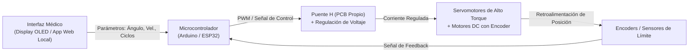

  <h1>🦾 Brazo Robótico de Rehabilitación Médica (CPM)</h1>
  
<em>Sistema de Movimiento Pasivo Continuo (CPM) accesible para recuperación de movilidad en miembro superior</em>

  
  
  

---

## 🎯 El Problema

Los equipos CPM (Continuous Passive Motion) comerciales utilizados en hospitales para la rehabilitación de hombro, codo y muñeca tienen dos problemas fundamentales:

1. **Costo prohibitivo**: Un equipo importado puede costar entre $3,000 y $15,000 USD, haciéndolos inaccesibles para centros de salud públicos y clínicas pequeñas en Venezuela.
2. **Inflexibilidad**: Los parámetros clínicos (rango de movimiento, velocidad, fuerza de resistencia) están preconfigurados por el fabricante y no pueden adaptarse fácilmente a la evolución individual del paciente.

---

## 💡 La Solución: Diseño Multidisciplinario

Este proyecto fue el resultado de una colaboración técnica donde el aporte principal fue el **desarrollo de software y la arquitectura de control**, mientras el diseño mecánico y la validación clínica involucraron a especialistas de otras áreas.

El sistema resultante tiene 3 grados de libertad y permite ejercitar flexión/extensión de codo, rotación de antebrazo y movimientos combinados de muñeca.

---

## 🏗️ Arquitectura del Sistema de Control

---

## 🛠️ Stack Técnico

| Categoría | Componentes |
|---|---|
| **Microcontrolador** | Arduino UNO / ESP32 (según módulo) |
| **Firmware** | C++ (Arduino IDE), lógica de control de movimiento segura |
| **Interfaz de Usuario** | Display OLED I2C + controles físicos (encoders rotativos) |
| **Electrónica de Potencia** | PCB custom: Puente H (L298N mejorado), regulador de voltaje LM7812 |
| **Actuadores** | Servomotores MG996R + Motores DC con encoder de cuadratura |
| **Materiales** | PLA+ (Impresión 3D FDM), perfiles de aluminio estructural |

---

## 📐 Parámetros Clínicos Configurables

| Parámetro | Rango | Unidad |
|---|---|---|
| Ángulo de Flexión | 0° — 135° | Grados |
| Velocidad de Movimiento | 5 — 60 | °/segundo |
| Ciclos por Sesión | 1 — 200 | Repeticiones |
| Pausa entre Ciclos | 0 — 10 | Segundos |

---

## 🚀 Impacto y Resultados

- **Reducción de costo del 80%+** frente a equipos CPM comerciales importados.
- **Validación positiva** con retroalimentación directa de personal de salud durante pruebas de prototipo.
- Demostración de que la ingeniería local puede resolver necesidades médicas reales con recursos accesibles.

---

> Proyecto académico/investigación. Desarrollado por **Gustavo Matheus** · *Embedded Systems & Firmware Developer*
